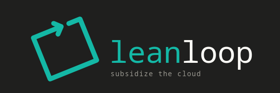

<p align="center">
  
</p>

# lean-loop

A small auto-fix loop that drives an agent CLI (Qwen Code, Claude Code,
aider, etc.) against a local or remote LLM, with a deliberately **lean
per-task context** — fresh state per call, no history bloat, only the files
you list. That's what makes it usable with a tiny local model that would
otherwise choke on the chat history a typical agent framework piles up.

Define bite-sized tasks in TOML, point it at your test runner, and let it
iterate until the tests pass.

## The Purpose
This is my answer to subsidizing cloud API costs with my local LLM with a workflow I can trust. The workflow I got nailed down is that I would talk with the godfather cloud AI about a feature, say something like full stack notifications for a web app. Cloud AI will read through and create the task toml file and it would kick off the lean-loop script. The local AI would do the bulk of the work autonomously leading to a 5x cloud saving expenditure according to Claude code. The savings scale linearly with feature and task length.

## Quick start

Assumes you already have an OpenAI-compatible LLM server reachable at
`http://127.0.0.1:8080/v1` (e.g. `llama-server` from llama.cpp serving a
local GGUF) and the [Qwen Code CLI](https://github.com/QwenLM/qwen-code) on
your `PATH`.

```
git clone <this repo> lean-loop && cd lean-loop
chmod +x leanloop.py leaners/qwen.sh
cd playground/demo
../../leanloop.py -c leanfile.toml
```

Watch it iterate through three tasks against the bundled `playground/demo/`
project until pytest goes green. If the server is on a different host/port
or the model name differs, edit `[lean]` in `config.toml`.

## The loop

```
for each task in leanfile.toml:
    1. read the listed files + git diff
    2. send task + context to the wrapped CLI (fresh context, no history)
    3. wrapped CLI edits files directly
    4. run the test command
    5. if tests pass -> next task
       if tests fail -> enter fix loop (up to max_iters):
           a. compress the error output (tail N lines, strip dep noise)
           b. ask the wrapped CLI for a one-sentence diagnosis
              (skippable — set `[defaults] summarize_errors = false`
              to pass the trimmed output from (a) straight to (c))
           c. ask the wrapped CLI to fix it
           d. re-run tests; loop
```

Each model call is self-contained — no chat history is carried between tasks
or iterations. The wrapped agent CLI does the actual file writes;
`leanloop.py` only orchestrates.

## Requirements

- Python 3.11+ (stdlib only — no `pip install` needed)
- An agent CLI on your `PATH` that can edit files autonomously. The shipped
  wrapper targets [Qwen Code CLI](https://github.com/QwenLM/qwen-code); see
  [Other wrappers](#other-wrappers) for swapping in claude / aider / gemini /
  etc.
- A running LLM endpoint that your chosen CLI can talk to (e.g.
  `llama-server` from llama.cpp serving a Qwen GGUF, or a hosted API).

## Install

Two options:

**Clone and run**
```
git clone <this repo> lean-loop && cd lean-loop
python3 leanloop.py --help
```

**`pipx install`** (gets you a `lean-loop` command on PATH):
```
pipx install /path/to/lean-loop
mkdir -p ~/.config/lean-loop && cp /path/to/lean-loop/config.toml ~/.config/lean-loop/
lean-loop --help
```

## Setup

1. Start your LLM server (e.g. `llama-server -m Qwen3.6-35B-A3B.gguf --host 127.0.0.1 --port 8080`).
2. Edit `config.toml` (next to `leanloop.py`, or `~/.config/lean-loop/config.toml`
   if you installed via pipx) — set `[lean] model`, `base_url`,
   `[health] check_url` to match your server.
3. In your project, run `lean-loop --init leanfile.toml` (or
   `python /path/to/leanloop.py --init leanfile.toml`) to drop a sample task
   config, then edit it: point `[runner]` at your test command and add
   `[[tasks]]` blocks. See [`examples/`](examples/) for samples.
4. `lean-loop -c leanfile.toml`
5. (Optional) Set up the MCP server for file-aware queries against your local
   LLM — see [lean-mcp server](#lean-mcp-server) below.

## Config

Two files, deep-merged at load time:

- **`config.toml`** (ships with the tool, alongside `leanloop.py`) — static,
  per-user defaults: wrapper binary path, model, server URL, base behavior
  knobs. Customize once for your environment.
- **`leanfile.toml`** (per-project) — `[runner]`, `[[tasks]]`, and any
  per-project overrides (e.g. `[defaults] source_prefix = "src/"`). Anything
  set here wins over `config.toml`.

Static config discovery: `--global-config` flag -> `$LEANLOOP_CONFIG` env var ->
`config.toml` next to `leanloop.py` -> `~/.config/lean-loop/config.toml`.

## lean-mcp server

An optional MCP (Model Context Protocol) server ships at `lean-mcp/server.py`.
It exposes a single tool — **`ask_about`** — that routes questions about your
source files through the same local LLM that `lean-loop` uses. This lets you
interrogate your codebase from any MCP-compatible client (DeepSeek TUI, Claude
Desktop, etc.) without running a separate agent CLI.

### How it works

``` text
MCP client                  lean-mcp/server.py             local LLM
  │                              │                              │
  │  ask_about("what does        │                              │
  │   this function do?",        │                              │
  │   ["src/auth.py"])           │                              │
  │ ─────────────────────────►   │                              │
  │                              │  read src/auth.py            │
  │                              │  POST /v1/chat/completions   │
  │                              │ ──────────────────────────►  │
  │                              │ ◄──────────────────────────  │
  │ ◄─────────────────────────   │                              │
  │  {"file":"src/auth.py",      │                              │
  │   "status":"ok",             │                              │
  │   "response":"..."}          │                              │
```

- Reads each file from disk, sends `question + file content` to the LLM one at
  a time (serial — respects your GPU's capacity).
- Skips files exceeding the char limit and reports them as skipped.
- Returns structured JSON with per-file results and a summary.

### Install

The server needs the `mcp` Python package (its only external dependency):

``` bash
cd /path/to/lean-loop
python3 -m venv lean-mcp/.venv
lean-mcp/.venv/bin/pip install mcp
```

Or use the pinned list:

``` bash
lean-mcp/.venv/bin/pip install -r lean-mcp/requirements.txt
```

### Register with DeepSeek TUI

``` bash
deepseek mcp add lean-ask \
  --command /path/to/lean-loop/lean-mcp/.venv/bin/python3 \
  --arg /path/to/lean-loop/lean-mcp/server.py
deepseek mcp validate    # confirm it's alive
deepseek mcp tools       # should show ask_about
```

### Configuration

The server reuses `config.toml` from `lean-loop`. The `[lean]` section provides
the LLM endpoint (`base_url`, `model`, `api_key`). An optional `[mcp]` section
controls the per-file character limit:

``` toml
[mcp]
max_file_chars = 32000   # default; files over this are reported as skipped
```

### Usage

The tool accepts three parameters:

- **`question`** (required) — the question to ask about each file.
- **`files`** (required) — list of file paths (absolute, or relative to the
  project root).
- **`think`** (optional, default `false`) — enable the model's chain-of-thought
  reasoning. Turn this on for architecture reviews, security analysis, or
  ambiguous questions; leave it off for fast direct answers.

``` python
# Fast, direct answers (no reasoning overhead)
ask_about("What does this module export?", ["src/auth.py", "src/handler.py"])

# With reasoning for deeper analysis
ask_about("Is this implementation thread-safe?", ["src/scheduler.py"], think=True)
```

The response is a JSON object with per-file results and a summary:

``` json
{
  "results": [
    {
      "file": "src/auth.py",
      "status": "ok",
      "response": "This module handles JWT token verification...",
      "input_chars": 4231,
      "output_chars": 980
    },
    {
      "file": "src/huge.py",
      "status": "skipped",
      "reason": "file exceeds 32000-char limit (45123 chars)"
    },
    {
      "file": "src/gone.py",
      "status": "error",
      "reason": "cannot read file: /abs/path/src/gone.py"
    }
  ],
  "summary": {
    "total": 3,
    "ok": 1,
    "skipped": 1,
    "error": 1,
    "model": "Qwen3.6-35B-A3B-UD-Q4_K_M.gguf"
  }
}
```

### Chat template

If your local model uses a chat template that supports an `enable_thinking` flag
(e.g. Qwen3), you can set it here. The server passes
`"chat_template_kwargs": {"enable_thinking": true/false}` on every request.
The Qwen3 template is bundled at `lean-mcp/chat_template.txt` for reference.

### Requirements

- Python 3.11+
- `pip install mcp` (or use the venv setup above)
- A running LLM server on `http://127.0.0.1:8080/v1` (or whichever `base_url` is
  configured in `config.toml`)

## LeanerFiles (`leaners/`)

`leaners/qwen.sh` is a six-line wrapper that execs the `qwen` binary with
`LEAN_*` env vars. `leanloop.py` populates those vars from the merged
`[lean]` table before each call, so you don't normally touch this file.

The contract for any wrapper is tiny:

- Accept `-p "<prompt>"` as a CLI arg
- Read connection settings (model, base URL, API key, etc.) from `LEAN_*` env vars
- Have the wrapped CLI edit files autonomously (it must have native
  `edit_file` / `write_file` tools — text-only output won't work)
- Print non-empty stdout on success

### Other wrappers

Four sibling wrappers ship alongside `qwen.sh` for popular agent CLIs —
`claude.sh`, `gemini.sh`, `aider.sh`, `opencode.sh`. Swap with
`leanloop --set-leaner <name>` (run `leanloop --list-leaners` to see all).

> **Heads up:** only `qwen.sh` has been exercised end-to-end. The other
> four were written from each CLI's published docs and have *not* been
> smoke-tested against this loop. Flag surfaces move fast — expect to tweak
> the script for your CLI's exact version before relying on it in a long
> fix-loop run. PRs welcome once you've verified one.

## Modes

- **Task mode** — at least one `[[tasks]]` block in `leanfile.toml`. Tasks run
  sequentially; tests run after each task.
- **Direct mode** — no `[[tasks]]`. Runs the fix loop straight against
  whatever the test command spits out, fixing whatever breaks first.

## Language support

- **Test runner**: any command. Set `[runner] command` and `args` to whatever
  your project uses (pytest, `go test`, `npm test`, `cargo test`, `make
  check`, ...). Optional `shell = true` runs `command` as a shell line.
- **Traceback parsing**: tuned for Python (`File "x.py", line N`). For other
  languages the script falls back to "compressed error tail + git diff +
  task files" — fixes are coarser but it still works.

## Platform

Pure stdlib, no POSIX-only syscalls — runs on Linux, macOS, and Windows
(provided you have your chosen agent CLI and an LLM server reachable there).
The shipped wrappers in `leaners/` are bash, so on Windows either run them
through Git Bash / WSL or point `[lean] binary` at a `.bat`/`.ps1` equivalent.

## CLI

```
lean-loop [-c CONFIG] [-g GLOBAL_CONFIG] [--task NAME] [--init [FILE]]
          [--list-leaners] [--set-leaner NAME]
```

- `-c, --config` — per-project task config (default `leanfile.toml`)
- `-g, --global-config` — static config override
- `--task NAME` — run only the named task
- `--init [FILE]` — write a sample task config (default: stdout)
- `--list-leaners` — list wrapper scripts in `leaners/` and mark the active one
- `--set-leaner NAME` — set `[lean] binary` in the active static config to
  `leaners/NAME` (e.g. `--set-leaner claude` to switch to `leaners/claude.sh`)

## Examples

Sample `leanfile.toml` files for different test runners live in
[`examples/`](examples/) (pytest, `go test`, jest).

## Development

```
pip install -e ".[dev]"
pytest
```

Self-tests live in [`tests/`](tests/) and cover the pure-function bits
(config merge, traceback parsing, frame picking, preflight). End-to-end
runs against a real LLM are exercised by the BANDEEZY playground in
`playground/BANDEEZY/`.

## License

MIT — see [LICENSE](LICENSE).
